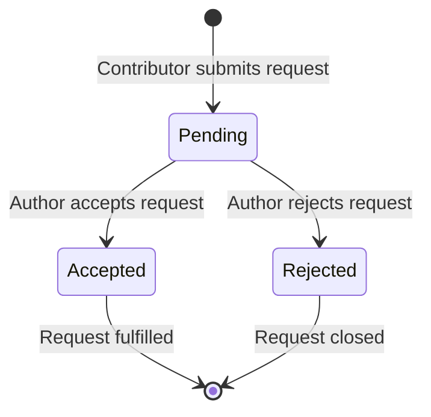

# Contribution Request System - Design Document

## Overview
This design plan outlines the implementation of a contribution request system for the Interactive Ideas platform. The system allows authenticated users (non-authors) to request contribution to ideas, while idea authors can manage these requests through a dedicated dashboard.

## Core Requirements Fulfillment
- ✅ **UI Integration**: Button placement, modal forms, loading states, error handling
- ✅ **Database Schema**: Structured table with proper relationships and indexes
- ✅ **Backend Logic**: Mutations for requests/queries, status management, real-time updates
- ✅ **Profile/Dashboard**: Dedicated management interface for authors
- ✅ **Authentication & Authorization**: Role-based access controls
- ✅ **Notifications System**: Real-time status updates
- ✅ **Edge Cases**: Concurrent updates, duplicate prevention, validation
- ✅ **Integration Safeguards**: No disruption to existing comment tree and features
- ✅ **Accessibility & Testing**: ARIA labels, keyboard navigation, responsiveness

## Database Schema Design

### ContributionRequests Table
```typescript
contributionRequests: defineTable({
  ideaId: v.id("ideas"), // Reference to ideas table
  contributorId: v.id("users"), // User making the request (non-author)
  authorId: v.id("users"), // Idea author (for fast author lookup)
  message: v.string(), // Contribution request message
  status: v.string(), // 'pending', 'accepted', 'rejected'
  createdAt: v.number(), // Unix timestamp
  updatedAt: v.number(), // Unix timestamp
})
.index("by_idea", ["ideaId"])
.index("by_contributor", ["contributorId"])
.index("by_author", ["authorId"])
.index("by_status", ["status"])
.index("by_author_status", ["authorId", "status"])
.index("by_contributor_idea", ["contributorId", "ideaId"]) // Prevent duplicates
```

**Relationships:**
- one-to-many: ideas → contributionRequests
- one-to-many: users (as contributor) → contributionRequests
- one-to-many: users (as author) → contributionRequests

### Counter Updates
Add to `ideas` table:
```typescript
contributionRequestCount: v.number(), // Track pending requests
```

## Component Hierarchy & UI Design

### Position: ContributeRequestButton
- **Location**: Above CommentsSection in `src/app/idea/[id]/page.tsx`
- **Props**: `ideaId: Id<"ideas">`, `isAuthor: boolean`, `hasPending: boolean`
- **Conditional Rendering**: Show only for authenticated non-authors
- **Styling**: Secondary button variant matching existing design

### ContributeRequestModal
- **Structure**: Dialog with form for contribution message
- **Components**:
  - Title: "Request to Contribute"
  - Textarea: Message input (max 500 chars)
  - Submit/Cancel buttons
- **States**: Loading, error handling
- **Accessibility**: ARIA labels, keyboard navigation

### Props Hierarchy
```typescript
ContributeRequestButtonProps = {
  ideaId: Id<"ideas">;
  isAuthor: boolean;
  existingRequestId?: Id<"contributionRequests">;
};

ContributeRequestModalProps = {
  ideaId: Id<"ideas">;
  contributorId: Id<"users">;
  isOpen: boolean;
  onClose: () => void;
};
```

## Backend Logic Design

### Mutations
```typescript
// Create contribution request
addContributionRequest: mutation({
  args: { ideaId, message },
  handler: async (ctx, args) => {
    // Auth check + validation
    // Duplicate prevention
    // Counter update
    // Return request data
  }
})

// Accept contribution request
acceptContributionRequest: mutation({
  args: { requestId },
  handler: async (ctx, args) => {
    // Author-only check
    // Status validation (must be pending)
    // Update request status
    // Send notification
  }
})

// Reject contribution request
rejectContributionRequest: mutation({
  args: { requestId },
  handler: async (ctx, args) => {
    // Similar to accept, different notification
  }
})
```

### Queries
```typescript
// Get pending requests for author
getContributionRequests: query({
  args: { status: v.optional(v.string()) },
  handler: async (ctx, args) => {
    // Return paginated requests with contributor details
  }
})

// Check if user has pending request for idea
hasContributionRequest: query({
  args: { ideaId, contributorId },
  handler: async (ctx) => {
    // Efficient lookup for UI state
  }
})
```

### Real-time Updates
Leverage Convex subscriptions for:
- Status changes on requests
- New request notifications
- Counter updates

## File Structure & Modifications

### Backend Files (Convex)
```
convex/
├── schema.ts                    # Add contributionRequests table
├── contribution-requests.ts     # New: all request CRUD operations
├── ideas.ts                     # Update: add counter management
└── users.ts                     # Update: add request-related queries
```

### Frontend Files
```
src/
├── components/
│   ├── contribution-request/
│   │   ├── contribute-request-button.tsx    # Request button component
│   │   ├── contribute-request-modal.tsx      # Request form modal
│   │   ├── request-status-badge.tsx          # Badge for request status
│   │   ├── contribution-request-item.tsx     # Individual request display
│   │   └── contribution-request-list.tsx     # List for dashboard
│   └── ui/
│       └── dialog.tsx                        # Reusable dialog (if needed)
├── app/
│   ├── idea/[id]/
│   │   └── page.tsx                          # Add ContributeRequestButton
│   ├── profile/
│   │   └── contribution-requests/
│   │       └── page.tsx                      # New: Request management dashboard
│   └── components/
│       └── ContributionRequestProvider.tsx   # Context for request state
└── lib/
    └── convex/
        └── providers.tsx                     # Add convex client config
```

## Request Lifecycle Workflow



### State Transitions
- **pending → accepted**: Author accepts
- **pending → rejected**: Author rejects
- **accepted/rejected → N/A**: Terminal states

### Validation Rules
- Only non-authors can request
- One request per user per idea
- Authors only can accept/reject
- Status must be pending for transitions

## Authentication & Authorization

### Request Creation
- Require authenticated user
- Must NOT be idea author
- No existing pending/accepted request
- Valid message content (non-empty, length limit)

### Request Management
- Only idea author can accept/reject
- Validate request exists and belongs to author
- Prevent status change if not pending

### UI Visibility
- Show button only to eligible users
- Hide button if request exists
- Author sees request count in profile

## Notification System Design

### Notification Types
- New contribution request received
- Request accepted/rejected
- Status change alerts

### Implementation Strategy
```typescript
// Notification mutations
notifyNewRequest: mutation({
  args: { requestId, recipientId },
  // Send real-time notification
})

notifyStatusChange: mutation({
  args: { requestId, oldStatus, newStatus },
  // Send status update notification
})
```

### UI Components
- In-app notification badge
- Toast messages for status changes
- Dashboard notification list
- Real-time updates using convex subscriptions

## Edge Cases & Error Handling

### Concurrent Updates
- Use Convex optimistic updates and conflict resolution
- Validate status before transitions
- Handle network failures gracefully

### Duplicate Prevention
- Index on (contributorId, ideaId)
- Query check before insertion
- Client-side validation

### Validation Edge Cases
- Empty messages
- Excessive length
- Users attempting to modify unauthorized requests
- Authors accepting/rejecting non-owned requests

### Error Messages
- "You cannot request contribution to your own idea"
- "You already have a pending contribution request"
- "Only the idea author can manage this request"
- "Request has already been processed"

## Integration Safeguards

### No Disruption to Comments
- Button placement maintains existing spacing
- No modification to CommentsSection component
- Existing comment tree functionality preserved
- Performance and responsiveness unchanged

### UI Consistency
- Match existing button/modals styling
- Use established loading/spinner components
- Follow current responsive design patterns
- Maintain accessibility standards

### Backend Safety
- Separate schema migrations
- Independent queries/mutations
- No impact on existing comment operations
- Counter updates isolated to contributions

## Accessibility & Testing Features

### ARIA Labels
- Role attributes on interactive elements
- Aria-describedby for form instructions
- Screen reader announcements for status changes
- Focus management in modals

### Keyboard Navigation
- Tab order through form elements
- Enter to submit, Escape to cancel
- Arrow key navigation in lists
- Focus traps in modals

### Loading States
- Button disabled during submissions
- Loading indicators for all async operations
- Error message display with retry options
- Skeleton loaders for request lists

### Testing Plan
- Unit tests for mutations and queries
- Component tests with different auth states
- E2E tests for request workflow
- Accessibility audits with automated tools

## Performance Considerations

### Query Optimization
- Efficient indexes on commonly filtered fields
- Pagination for request lists
- Lazy loading of contributor details
- Cached user profiles

### UI Optimization
- Virtual scrolling for long request lists
- Conditional rendering based on auth state
- Reactive updates without full re-renders
- Minimal bundle size additions

## Implementation Roadmap

### Phase 1: Core Backend
1. Add contributionRequests table to schema
2. Implement `addContributionRequest` mutation
3. Add query for existing requests check
4. Update ideas counter management

### Phase 2: Basic UI
1. Create ContributeRequestButton component
2. Implement ContributeRequestModal
3. Integrate button in idea detail page
4. Add loading/error states

### Phase 3: Dashboard & Management
1. Create author dashboard page
2. Implement request list component
3. Add accept/reject actions
4. Build notification system

### Phase 4: Polish & Testing
1. Add accessibility features
2. Implement notification system
3. Edge case testing
4. Performance optimization

## Success Criteria

- ✅ Seamlessly integrated with existing system
- ✅ No disruption to current comment tree functionality
- ✅ Complete request lifecycle from creation to resolution
- ✅ Robust error handling and validation
- ✅ Accessible and responsive design
- ✅ Real-time notifications and updates
- ✅ Efficient performance with existing codebase

This design ensures the contribution request system enhances the platform while preserving all existing functionality and maintaining code quality standards.