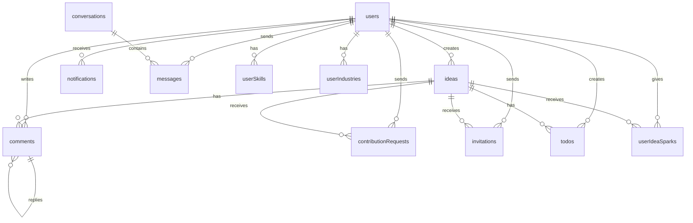

# Database Schema Documentation

## 📊 Overview

The Interactive Ideas Platform uses Convex as its real-time database with a carefully designed schema that supports user-generated content, collaboration features, and social networking capabilities.

## 🗂️ Core Tables

### Users Table

**Purpose**: Stores complete user profiles and authentication data.

```typescript
users: defineTable({
  clerkId: v.string(),           // Clerk authentication ID
  username: v.string(),          // Unique username for URLs
  displayName: v.string(),       // Human-readable display name
  bio: v.optional(v.string()),   // User biography (max 500 chars)
  avatar: v.optional(v.string()), // Avatar image URL
  location: v.optional(v.string()), // Geographic location
  website: v.optional(v.string()), // Personal website URL
  github: v.optional(v.string()),  // GitHub profile URL
  linkedin: v.optional(v.string()), // LinkedIn profile URL
  twitter: v.optional(v.string()), // Twitter handle
  skills: v.optional(v.array(v.string())), // Skills array (handled via userSkills)
  industry: v.optional(v.string()), // Primary industry
  completedOnboarding: v.boolean(), // Onboarding completion flag
  isActive: v.optional(v.boolean()), // Account status
  role: v.optional(v.string()),   // User role (user, moderator, admin)
  followersCount: v.optional(v.number()), // Social metrics
  followingCount: v.optional(v.number()),
  lastLoginAt: v.optional(v.number()), // Activity tracking
  createdAt: v.number(),         // Timestamps
  updatedAt: v.number(),
})
```

**Indexes**:
- `by_clerk_id` - Authentication lookups
- `by_username` - Profile URL generation
- `by_completed_onboarding` - Onboarding queries
- `by_role` - Admin/moderator queries
- `by_is_active` - Account management
- `by_created_at` - User analytics

### Ideas Table

**Purpose**: Core content storage for user-generated ideas.

```typescript
ideas: defineTable({
  authorId: v.id("users"),       // Reference to author
  title: v.string(),             // Idea title (required, max 200 chars)
  description: v.string(),       // Full description (required)
  category: v.string(),          // Primary category
  industries: v.optional(v.string()), // Industries (comma-separated)
  visibility: v.string(),        // 'public' or 'private'
  attachments: v.optional(v.array(v.object({
    name: v.string(),            // File name
    type: v.string(),            // MIME type
    size: v.number(),            // File size in bytes
    url: v.string(),             // File URL
    fileId: v.string(),          // Convex storage ID
  }))),
  sparkCount: v.number(),        // Like/interaction count
  commentCount: v.number(),      // Comment count
  contributionRequestCount: v.optional(v.number()), // Collaboration requests
  createdAt: v.number(),         // Creation timestamp
  updatedAt: v.number(),         // Last update timestamp
  isDeleted: v.optional(v.boolean()), // Soft delete flag
  parentId: v.optional(v.id("ideas")), // For idea hierarchies
})
```

**Indexes**:
- `by_author` - User's ideas
- `by_visibility` - Public/private filtering
- `by_category` - Category browsing
- `by_industries` - Industry filtering
- `by_created_at` - Chronological sorting
- `by_author_visibility` - User's visible ideas
- `by_category_created` - Category + time sorting
- `by_industries_created` - Industry + time sorting
- `by_is_deleted` - Soft delete queries
- `by_parent` - Hierarchical relationships

## 🤝 Collaboration Tables

### Contribution Requests Table

**Purpose**: Manages collaboration requests between users.

```typescript
contributionRequests: defineTable({
  ideaId: v.id("ideas"),         // Target idea
  contributorId: v.id("users"),   // Requesting user
  authorId: v.id("users"),       // Idea author
  message: v.string(),           // Request message
  status: v.union(               // Request status
    v.literal("pending"),
    v.literal("accepted"),
    v.literal("rejected")
  ),
  createdAt: v.number(),
  updatedAt: v.number(),
})
```

**Indexes**:
- `by_idea_status_created` - Idea requests by status and time
- `by_idea_contributor` - User's requests per idea
- `by_contributor_status` - User's requests by status
- `by_author_created` - Received requests by time

### Invitations Table

**Purpose**: Formal invitations for idea contributions.

```typescript
invitations: defineTable({
  ideaId: v.id("ideas"),         // Target idea
  inviterId: v.id("users"),      // Inviting user
  inviteeId: v.id("users"),      // Invited user
  status: v.union(               // Invitation status
    v.literal("pending"),
    v.literal("accepted"),
    v.literal("rejected"),
    v.literal("cancelled")
  ),
  message: v.optional(v.string()), // Optional invitation message
  createdAt: v.number(),
  updatedAt: v.number(),
})
```

**Indexes**:
- `by_idea` - Idea invitations
- `by_inviter` - Sent invitations
- `by_invitee` - Received invitations
- `by_idea_status` - Idea invitations by status
- `by_invitee_status` - User's invitations by status
- `by_created_at` - Chronological sorting

## 📝 Content Tables

### Comments Table

**Purpose**: Discussion threads on ideas.

```typescript
comments: defineTable({
  ideaId: v.id("ideas"),         // Parent idea
  authorId: v.id("users"),       // Comment author
  content: v.string(),           // Comment text
  createdAt: v.number(),         // Creation timestamp
  parentCommentId: v.optional(v.id("comments")), // Nested replies
})
```

**Indexes**:
- `by_idea` - Idea comments
- `by_author` - User's comments
- `by_idea_created` - Comments by time
- `by_parent` - Reply threads

### Todos Table

**Purpose**: Task management for idea development.

```typescript
todos: defineTable({
  ideaId: v.id("ideas"),         // Associated idea
  authorId: v.id("users"),       // Task creator
  assignedTo: v.optional(v.id("users")), // Assigned user
  title: v.string(),             // Task title
  status: v.union(               // Task status
    v.literal("todo"),
    v.literal("in_progress"),
    v.literal("done")
  ),
  order: v.optional(v.number()), // Display order
  deadline: v.optional(v.number()), // Due date timestamp
  completionTarget: v.optional(v.string()), // Completion criteria
  createdAt: v.number(),
  updatedAt: v.number(),
})
```

**Indexes**:
- `by_idea` - Idea tasks
- `by_author` - Created tasks
- `by_assigned_to` - Assigned tasks
- `by_deadline` - Upcoming deadlines
- `by_idea_status` - Tasks by status
- `by_created_at` - Chronological sorting

## 💬 Communication Tables

### Conversations Table

**Purpose**: Chat conversation metadata.

```typescript
conversations: defineTable({
  participant1: v.id("users"),   // First participant
  participant2: v.id("users"),   // Second participant
  createdAt: v.number(),
  updatedAt: v.number(),
  lastMessageId: v.optional(v.id("messages")), // Latest message
  unreadCount: v.optional(v.number()), // Unread messages
})
```

**Indexes**:
- `by_participant1` - User's conversations
- `by_participant2` - User's conversations
- `by_created_at` - Conversation history
- `by_participants` - Unique conversation lookup

### Messages Table

**Purpose**: Individual chat messages.

```typescript
messages: defineTable({
  senderId: v.id("users"),       // Message sender
  receiverId: v.id("users"),     // Message receiver
  content: v.string(),           // Message content
  createdAt: v.number(),         // Send timestamp
  read: v.boolean(),             // Read status
  conversationId: v.id("conversations"), // Parent conversation
  messageType: v.optional(v.string()), // 'text', 'image', etc.
})
```

**Indexes**:
- `by_sender` - Sent messages
- `by_receiver` - Received messages
- `by_conversation` - Conversation messages
- `by_conversation_created` - Messages by time
- `by_created_at` - Global message history

## 🔔 Notification Tables

### Notifications Table

**Purpose**: User notifications for platform activities.

```typescript
notifications: defineTable({
  recipientId: v.id("users"),    // Notification recipient
  senderId: v.id("users"),       // Activity trigger user
  type: v.string(),              // Notification type
  message: v.string(),           // Notification content
  relatedId: v.optional(v.union( // Related entity
    v.id("ideas"),
    v.id("comments"),
    v.id("contributionRequests"),
    v.id("todos"),
    v.id("invitations")
  )),
  isRead: v.boolean(),           // Read status
  createdAt: v.number(),         // Creation timestamp
})
```

**Indexes**:
- `by_recipient` - User's notifications
- `by_recipient_read` - Unread notifications
- `by_recipient_created` - Notifications by time
- `by_sender` - Triggered notifications
- `by_related` - Entity notifications
- `by_type` - Notification type filtering
- `by_created_at` - Global notification history

## 👥 Social Features Tables

### User Skills Table

**Purpose**: Many-to-many relationship for user skills.

```typescript
userSkills: defineTable({
  userId: v.id("users"),         // User reference
  skillName: v.string(),         // Skill name
})
```

**Indexes**:
- `by_user` - User's skills
- `by_skill` - Skill users

### User Industries Table

**Purpose**: Many-to-many relationship for user industries.

```typescript
userIndustries: defineTable({
  userId: v.id("users"),         // User reference
  industryName: v.string(),      // Industry name
})
```

**Indexes**:
- `by_user` - User's industries
- `by_industry` - Industry users

### User Idea Sparks Table

**Purpose**: Like/interaction tracking.

```typescript
userIdeaSparks: defineTable({
  userId: v.id("users"),         // Liking user
  ideaId: v.id("ideas"),         // Liked idea
  createdAt: v.number(),         // Like timestamp
})
```

**Indexes**:
- `by_user` - User's likes
- `by_idea` - Idea likes
- `by_user_idea` - Unique like check

## 🔐 Security Tables

### User Sessions Table

**Purpose**: Session management for security.

```typescript
userSessions: defineTable({
  userId: v.id("users"),         // User reference
  sessionId: v.string(),         // Session identifier
  expiresAt: v.number(),         // Expiration timestamp
})
```

**Indexes**:
- `by_session` - Session lookup
- `by_user_expires` - User's active sessions

## 📈 Data Relationships

### Entity Relationship Diagram



## 🔍 Query Patterns

### Common Query Examples

```typescript
// Get user's public ideas with engagement metrics
const userIdeas = await ctx.db
  .query("ideas")
  .withIndex("by_author_visibility", (q) =>
    q.eq("authorId", userId).eq("visibility", "public")
  )
  .order("createdAt", "desc")
  .take(20)

// Get unread notifications with sender info
const notifications = await ctx.db
  .query("notifications")
  .withIndex("by_recipient_read", (q) =>
    q.eq("recipientId", userId).eq("isRead", false)
  )
  .order("createdAt", "desc")
  .take(50)

// Get active contribution requests for idea
const requests = await ctx.db
  .query("contributionRequests")
  .withIndex("by_idea_status_created", (q) =>
    q.eq("ideaId", ideaId).eq("status", "pending")
  )
  .order("createdAt", "asc")
```

## 🚀 Performance Considerations

### Indexing Strategy
- **Compound indexes** for multi-field queries
- **Time-based indexes** for chronological sorting
- **Foreign key indexes** for relationship queries
- **Status indexes** for filtering active records

### Data Access Patterns
- **Read-heavy optimization** for feed and discovery features
- **Write optimization** for real-time collaboration
- **Pagination support** for large result sets
- **Caching strategies** for frequently accessed data

### Scalability Features
- **Horizontal partitioning** potential with user-based sharding
- **Archive strategies** for old data
- **Soft deletes** for data retention compliance
- **Audit trails** for sensitive operations

This schema design supports the platform's core features while maintaining performance, data integrity, and scalability requirements.