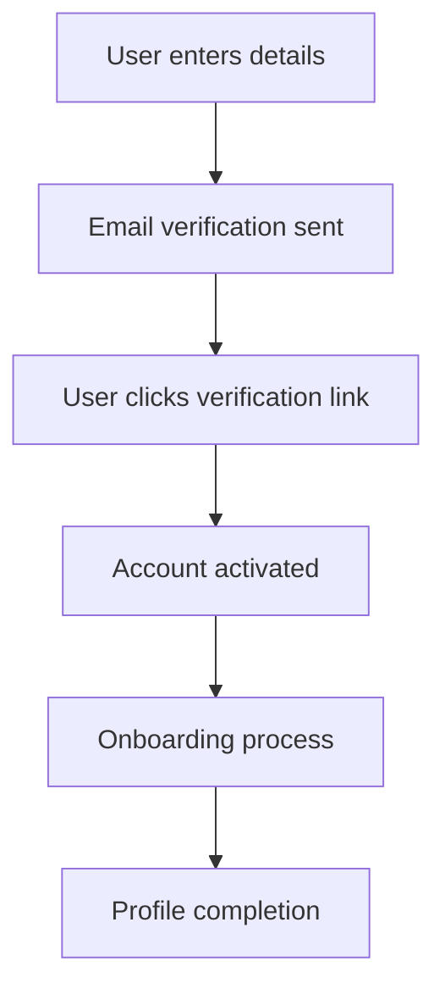

# Authentication & User Management

## 🔐 Overview

The Interactive Ideas Platform uses Clerk for comprehensive authentication and user management, providing secure access control and seamless user experiences across all platform features.

## 🎯 Core Features

### User Registration
**Purpose**: Onboard new users with secure account creation.

**Supported Methods**:
- **Email/Password**: Traditional registration with email verification
- **Social Providers**: Google, GitHub, and other OAuth providers
- **Email Verification**: Mandatory email confirmation before account activation

**Registration Flow**:


**Implementation**:
```typescript
// Sign-up component
import { SignUp } from '@clerk/nextjs'

export default function SignUpPage() {
  return (
    <SignUp
      path="/sign-up"
      routing="path"
      signInUrl="/sign-in"
      redirectUrl="/onboarding"
    />
  )
}
```

### User Authentication
**Purpose**: Secure login and session management.

**Authentication Methods**:
- **Email/Password**: Standard login with password
- **Social Login**: OAuth with Google, GitHub, etc.
- **Magic Links**: Passwordless authentication via email
- **Multi-factor Authentication**: Optional 2FA for enhanced security

**Session Management**:
- **Automatic Refresh**: Seamless token renewal
- **Cross-device Sync**: Consistent sessions across devices
- **Security Monitoring**: Suspicious activity detection

### User Profiles
**Purpose**: Comprehensive user profile management.

**Profile Components**:
- **Basic Information**: Name, username, bio
- **Contact Details**: Email, website, social links
- **Professional Info**: Skills, industries, location
- **Preferences**: Theme, notification settings

**Profile Schema**:
```typescript
interface UserProfile {
  // Clerk-managed fields
  clerkId: string
  email: string
  firstName?: string
  lastName?: string

  // Custom fields
  username: string
  displayName: string
  bio?: string
  avatar?: string
  location?: string
  website?: string
  github?: string
  linkedin?: string
  twitter?: string
  skills: string[]
  industries: string[]
  completedOnboarding: boolean
}
```

## 🛡️ Security Features

### Password Security
**Requirements**:
- Minimum 8 characters
- Mix of uppercase, lowercase, numbers, symbols
- No common passwords
- Regular password rotation prompts

### Session Security
**Protections**:
- **Secure Cookies**: HttpOnly, Secure, SameSite flags
- **Token Expiration**: Automatic logout after inactivity
- **Device Management**: View and revoke active sessions
- **Suspicious Activity**: Login attempt monitoring

### Account Recovery
**Recovery Options**:
- **Password Reset**: Email-based password recovery
- **Account Recovery Codes**: Backup codes for account access
- **Security Questions**: Alternative verification method

## 👥 User Roles & Permissions

### Role System
**Available Roles**:
- **User**: Standard platform user with basic access
- **Moderator**: Content moderation and community management
- **Admin**: Full platform administration access

**Role Permissions**:
```typescript
const rolePermissions = {
  user: [
    'create_ideas',
    'edit_own_ideas',
    'comment',
    'send_requests',
    'use_chat'
  ],
  moderator: [
    'user_permissions',
    'moderate_content',
    'view_reports',
    'suspend_users'
  ],
  admin: [
    'moderator_permissions',
    'system_settings',
    'user_management',
    'platform_analytics'
  ]
}
```

### Permission Checking
**Implementation**:
```typescript
// Permission guard hook
export const usePermissions = () => {
  const { user } = useUser()

  const hasPermission = (permission: string) => {
    const userRole = user?.publicMetadata?.role || 'user'
    return rolePermissions[userRole]?.includes(permission) || false
  }

  return { hasPermission }
}
```

## 🎨 User Experience

### Onboarding Flow
**Purpose**: Guide new users through platform setup.

**Onboarding Steps**:
1. **Welcome**: Platform introduction
2. **Profile Setup**: Basic information collection
3. **Skills & Interests**: Professional background
4. **Preferences**: Theme and notification settings
5. **First Idea**: Guided idea creation

### Profile Customization
**Options**:
- **Avatar Upload**: Image cropping and optimization
- **Theme Selection**: Light/dark mode preferences
- **Privacy Settings**: Profile visibility controls
- **Notification Preferences**: Granular notification control

## 🔗 Integration Details

### Clerk Setup
**Environment Variables**:
```bash
# Clerk Configuration
NEXT_PUBLIC_CLERK_PUBLISHABLE_KEY=pk_test_...
CLERK_SECRET_KEY=sk_test_...

# Clerk URLs
NEXT_PUBLIC_CLERK_SIGN_IN_URL=/sign-in
NEXT_PUBLIC_CLERK_SIGN_UP_URL=/sign-up
NEXT_PUBLIC_CLERK_AFTER_SIGN_IN_URL=/dashboard
NEXT_PUBLIC_CLERK_AFTER_SIGN_UP_URL=/onboarding
```

### Database Integration
**User Synchronization**:
```typescript
// Convex user creation on Clerk webhook
export const createUser = mutation({
  args: {
    clerkId: v.string(),
    email: v.string(),
    username: v.string(),
    displayName: v.string()
  },
  handler: async (ctx, args) => {
    const userId = await ctx.db.insert("users", {
      clerkId: args.clerkId,
      username: args.username,
      displayName: args.displayName,
      email: args.email,
      completedOnboarding: false,
      createdAt: Date.now(),
      updatedAt: Date.now()
    })

    return userId
  }
})
```

## 📱 Mobile Experience

### Responsive Authentication
**Mobile Optimizations**:
- **Touch-friendly**: Large tap targets for mobile
- **Biometric Support**: Fingerprint/Face ID integration
- **Progressive Web App**: Installable web app
- **Offline Support**: Basic functionality without connection

### Cross-device Sync
**Features**:
- **Session Continuity**: Seamless experience across devices
- **Data Synchronization**: Profile and preference sync
- **Security**: Device-specific session management

## 📊 Analytics & Monitoring

### User Analytics
**Tracked Metrics**:
- **Registration Funnel**: Conversion rates and drop-off points
- **Login Patterns**: Frequency and device preferences
- **Profile Completion**: Onboarding success rates
- **Retention**: User engagement over time

### Security Monitoring
**Security Events**:
- **Failed Login Attempts**: Brute force detection
- **Suspicious Activity**: Unusual login patterns
- **Password Changes**: Security event logging
- **Session Anomalies**: Unusual session behavior

## 🚨 Error Handling

### Authentication Errors
**Common Scenarios**:
- **Invalid Credentials**: Wrong email/password combination
- **Account Locked**: Too many failed attempts
- **Email Unverified**: Account not activated
- **Session Expired**: Automatic logout required

**Error Responses**:
```typescript
const authErrors = {
  'invalid_credentials': 'Email or password is incorrect',
  'account_locked': 'Account temporarily locked due to security',
  'email_unverified': 'Please verify your email address',
  'session_expired': 'Your session has expired. Please sign in again'
}
```

### Recovery Flows
**Self-service Options**:
- **Password Reset**: Email-based recovery
- **Account Unlock**: Automatic unlock after cooldown
- **Support Contact**: Human assistance for complex issues

## 🔧 Administration

### User Management
**Admin Capabilities**:
- **User Search**: Find users by email, username, or ID
- **Account Status**: Activate, suspend, or delete accounts
- **Role Assignment**: Change user roles and permissions
- **Bulk Operations**: Mass user management actions

### Audit Logging
**Logged Events**:
- **Authentication Events**: Login, logout, password changes
- **Profile Changes**: Updates to user information
- **Security Events**: Failed attempts, suspicious activity
- **Administrative Actions**: Role changes, account modifications

## 📚 Best Practices

### Security Guidelines
- **Regular Audits**: Security assessment and penetration testing
- **Password Policies**: Strong password requirements
- **Session Timeouts**: Automatic logout for inactive sessions
- **Data Encryption**: Sensitive data protection

### User Experience
- **Clear Feedback**: Loading states and error messages
- **Progressive Enhancement**: Core functionality without JavaScript
- **Accessibility**: WCAG compliance for authentication flows
- **Performance**: Fast loading and responsive interactions

### Development Practices
- **Type Safety**: Full TypeScript implementation
- **Error Boundaries**: Graceful error handling
- **Testing**: Comprehensive test coverage for auth flows
- **Documentation**: Clear API and integration documentation

This authentication system provides a robust, secure, and user-friendly foundation for the Interactive Ideas Platform, ensuring both security and excellent user experience.