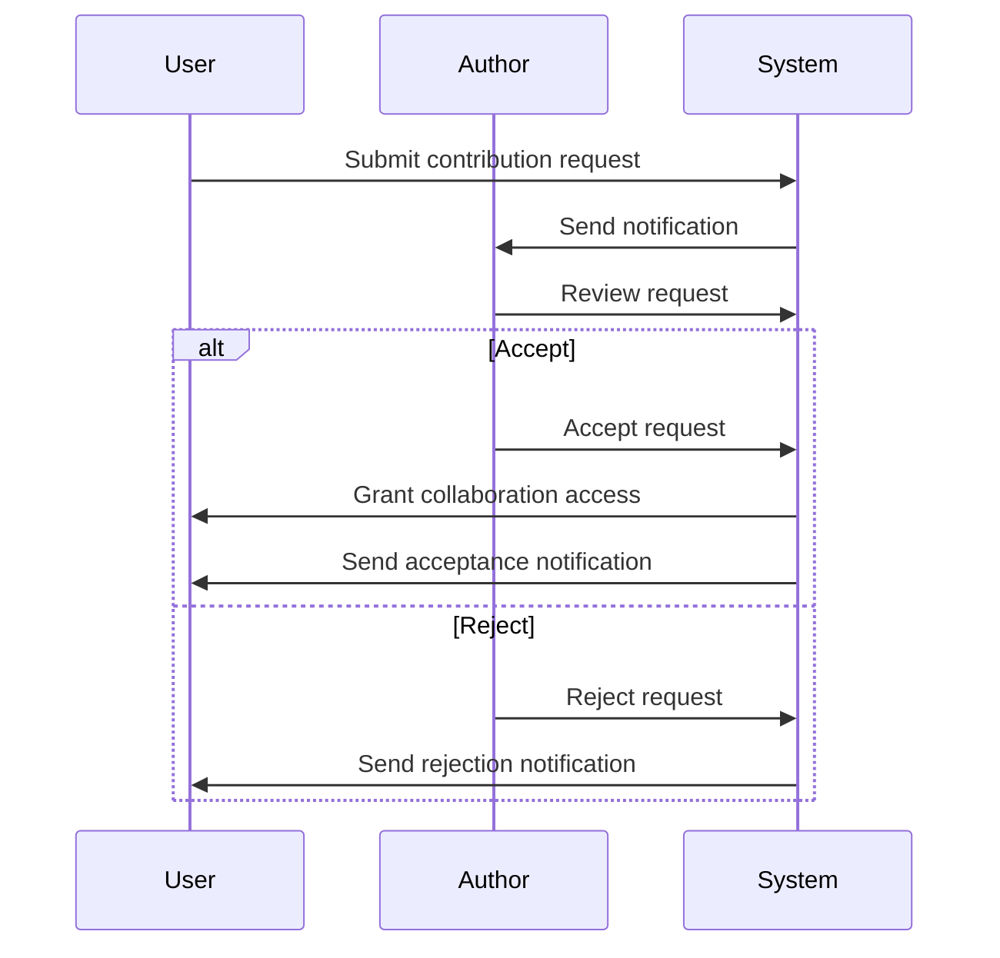

# Collaboration System

## 🤝 Overview

The collaboration system is the core of the Interactive Ideas Platform, enabling users to work together on innovative ideas through structured workflows, task management, and communication tools.

## 🎯 Core Components

### Contribution Requests
**Purpose**: Allow users to request collaboration on ideas they're interested in.

**Request Flow**:


**Request Schema**:
```typescript
interface ContributionRequest {
  id: string
  ideaId: string
  contributorId: string
  authorId: string
  message: string
  status: 'pending' | 'accepted' | 'rejected'
  createdAt: number
  updatedAt: number
}
```

**Key Features**:
- **Personalized Messages**: Contributors can explain their interest and expertise
- **Status Tracking**: Clear visibility into request status
- **Notification System**: Automatic notifications for all status changes
- **Collaboration History**: Record of all collaboration requests

### Invitations
**Purpose**: Enable idea authors to proactively invite collaborators.

**Invitation Workflow**:
1. **User Search**: Author searches for potential collaborators
2. **Invitation Creation**: Author sends personalized invitation
3. **Response Handling**: Invitee accepts or declines
4. **Permission Granting**: Automatic access upon acceptance

**Invitation Types**:
- **Specific Users**: Targeted invitations to known users
- **Skill-based**: Invitations based on required expertise
- **Open Calls**: Public invitations for anyone interested

### Access Control
**Purpose**: Define collaboration permissions and access levels.

**Permission Levels**:
```typescript
enum CollaborationPermission {
  VIEW = 'view',           // Read-only access
  COMMENT = 'comment',     // Can comment and discuss
  EDIT = 'edit',          // Can modify idea content
  MANAGE = 'manage',      // Can manage tasks and collaborators
  ADMIN = 'admin'         // Full control including access management
}
```

**Permission Matrix**:
| Permission | View Content | Add Comments | Edit Content | Manage Tasks | Manage Access |
|------------|-------------|--------------|--------------|--------------|----------------|
| View       | ✅          | ❌           | ❌          | ❌           | ❌            |
| Comment    | ✅          | ✅           | ❌          | ❌           | ❌            |
| Edit       | ✅          | ✅           | ✅          | ❌           | ❌            |
| Manage     | ✅          | ✅           | ✅          | ✅           | ❌            |
| Admin      | ✅          | ✅           | ✅          | ✅           | ✅            |

## 📋 Task Management

### Kanban Board
**Purpose**: Visual project management for idea development.

**Board Structure**:
```typescript
interface KanbanBoard {
  columns: KanbanColumn[]
  tasks: Task[]
}

interface KanbanColumn {
  id: string
  title: string
  order: number
  limit?: number // WIP limit
}

interface Task {
  id: string
  title: string
  description?: string
  status: TaskStatus
  assignedTo?: string
  dueDate?: number
  priority: 'low' | 'medium' | 'high' | 'urgent'
  tags: string[]
  order: number
}
```

**Default Columns**:
- **Backlog**: Ideas and tasks to be started
- **To Do**: Ready to work on
- **In Progress**: Currently active
- **Review**: Ready for feedback
- **Done**: Completed tasks

### Task Creation
**Purpose**: Structured task creation with all necessary details.

**Task Fields**:
- **Title**: Clear, actionable task name
- **Description**: Detailed requirements and context
- **Assignee**: Team member responsible
- **Due Date**: Deadline for completion
- **Priority**: Urgency level
- **Tags**: Categorization and filtering
- **Attachments**: Supporting files and resources

### Task Assignment
**Purpose**: Delegate work to appropriate team members.

**Assignment Features**:
- **Auto-assignment**: Based on skills and availability
- **Manual Assignment**: Direct selection by managers
- **Self-assignment**: Team members claim tasks
- **Reassignment**: Transfer tasks between collaborators

### Progress Tracking
**Purpose**: Monitor project advancement and identify bottlenecks.

**Metrics Tracked**:
- **Completion Rate**: Tasks completed vs total
- **Cycle Time**: Average time from start to completion
- **Work in Progress**: Current active tasks
- **Blockers**: Tasks stuck or waiting for input

## 💬 Communication System

### Real-time Chat
**Purpose**: Instant communication between collaborators.

**Chat Features**:
- **Direct Messages**: One-on-one conversations
- **Group Chats**: Multi-user discussions
- **Idea-specific Channels**: Discussion tied to specific ideas
- **File Sharing**: Document and resource sharing
- **Message Reactions**: Quick feedback on messages

**Message Types**:
```typescript
enum MessageType {
  TEXT = 'text',
  IMAGE = 'image',
  FILE = 'file',
  SYSTEM = 'system'  // Automated notifications
}
```

### Comments System
**Purpose**: Threaded discussions on ideas and tasks.

**Comment Features**:
- **Nested Threads**: Hierarchical discussion structure
- **Rich Formatting**: Text styling and formatting
- **Mention System**: @username notifications
- **Reaction System**: Emoji reactions to comments
- **Edit History**: Track comment modifications

## 🔔 Notification System

### Collaboration Notifications
**Purpose**: Keep collaborators informed of important events.

**Notification Types**:
- **Request Updates**: Acceptance/rejection of contribution requests
- **Invitation Events**: New invitations and responses
- **Task Changes**: Assignments, updates, completions
- **Comment Activity**: New comments and replies
- **Deadline Alerts**: Upcoming due dates and overdue tasks

### Notification Channels
**Delivery Methods**:
- **In-app Notifications**: Real-time UI updates
- **Email Digests**: Daily/weekly summaries
- **Browser Push**: Immediate alerts for urgent items
- **Mobile Push**: App notifications (future feature)

## 👥 Team Management

### Collaborator Roles
**Purpose**: Define team member responsibilities and permissions.

**Role Definitions**:
- **Contributor**: General team member with editing access
- **Reviewer**: Quality assurance and feedback provider
- **Coordinator**: Task assignment and progress tracking
- **Lead**: Strategic direction and final decisions

### Onboarding Process
**Purpose**: Smooth integration of new collaborators.

**Onboarding Steps**:
1. **Access Granting**: Automatic permission setup
2. **Idea Overview**: Context and background information
3. **Team Introduction**: Meet other collaborators
4. **Task Assignment**: Initial responsibilities
5. **Resource Access**: Documentation and tool setup

## 📊 Collaboration Analytics

### Productivity Metrics
**Tracked Measurements**:
- **Task Completion Rate**: Tasks finished on time
- **Communication Frequency**: Message and comment volume
- **Response Times**: Average time to respond to requests
- **Collaboration Reach**: Number of active contributors

### Engagement Tracking
**Activity Monitoring**:
- **Active Users**: Daily/weekly active collaborators
- **Contribution Volume**: Ideas, comments, task completions
- **Quality Metrics**: Code reviews, feedback scores
- **Retention Rates**: Long-term collaborator engagement

## 🔒 Privacy & Security

### Data Access Control
**Privacy Levels**:
- **Public Collaboration**: Visible to all platform users
- **Private Collaboration**: Restricted to invited members
- **Confidential**: NDA-required high-security projects

### Audit Logging
**Tracked Events**:
- **Access Events**: Login/logout and permission changes
- **Content Changes**: Idea edits and file modifications
- **Communication**: Message and comment history
- **Task Updates**: Assignment and status changes

## 🔧 Technical Implementation

### Real-time Synchronization
**Convex Subscriptions**:
```typescript
// Real-time collaboration updates
export const useCollaborationUpdates = (ideaId: string) => {
  return useSubscription(
    api.collaboration.subscribeToIdea,
    { ideaId }
  )
}

// Live task board updates
export const useTaskBoard = (ideaId: string) => {
  return useQuery(api.tasks.getBoard, { ideaId })
}
```

### Optimistic Updates
**UI Responsiveness**:
```typescript
const updateTaskStatus = async (taskId: string, status: TaskStatus) => {
  // Optimistic update
  setTasks(prev => prev.map(task =>
    task.id === taskId ? { ...task, status } : task
  ))

  try {
    await api.tasks.updateStatus({ taskId, status })
  } catch (error) {
    // Revert on error
    setTasks(prev)
    showError('Failed to update task')
  }
}
```

### Conflict Resolution
**Merge Strategies**:
- **Last Write Wins**: Simple conflicts
- **Manual Resolution**: Complex conflicts with user input
- **Version History**: Track all changes for audit

## 📱 Mobile Collaboration

### Responsive Design
**Mobile Optimizations**:
- **Touch-friendly Kanban**: Drag-and-drop on mobile
- **Gesture Support**: Swipe actions for task management
- **Offline Capability**: Basic functionality without connection
- **Push Notifications**: Mobile alerts for urgent updates

### Cross-device Sync
**Seamless Experience**:
- **State Synchronization**: Consistent view across devices
- **Progress Continuity**: Resume work on any device
- **Notification Routing**: Smart notification delivery

## 🎯 Best Practices

### Collaboration Guidelines
**Team Productivity**:
- **Clear Communication**: Regular updates and status meetings
- **Task Breakdown**: Small, manageable work units
- **Progress Visibility**: Transparent status tracking
- **Feedback Culture**: Constructive peer reviews

### Process Optimization
**Workflow Efficiency**:
- **Standardized Templates**: Consistent task and idea formats
- **Automation**: Automated notifications and status updates
- **Documentation**: Comprehensive project documentation
- **Knowledge Sharing**: Best practices and lessons learned

This collaboration system transforms individual ideas into collaborative projects, enabling teams to work together effectively while maintaining clear communication and progress tracking.