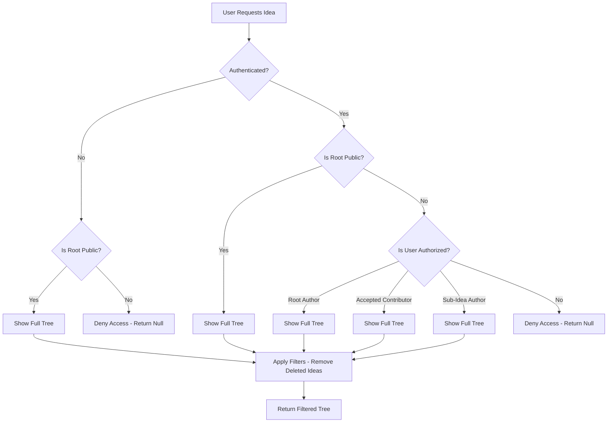
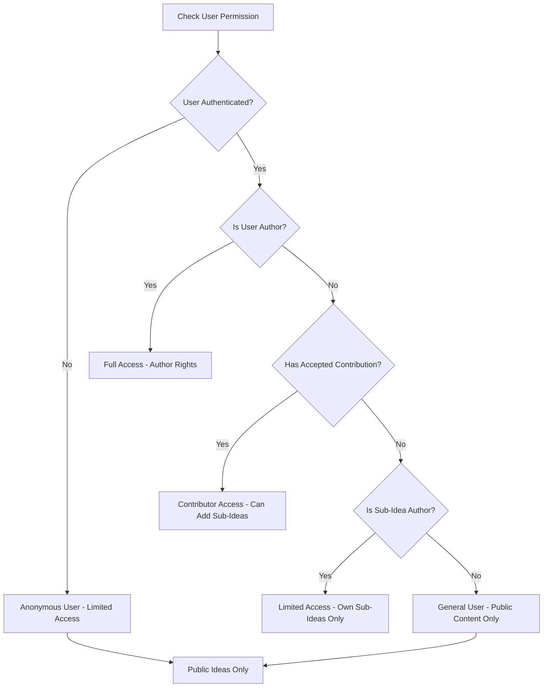
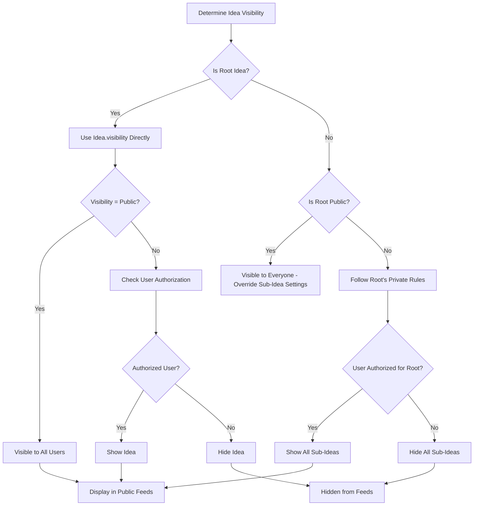
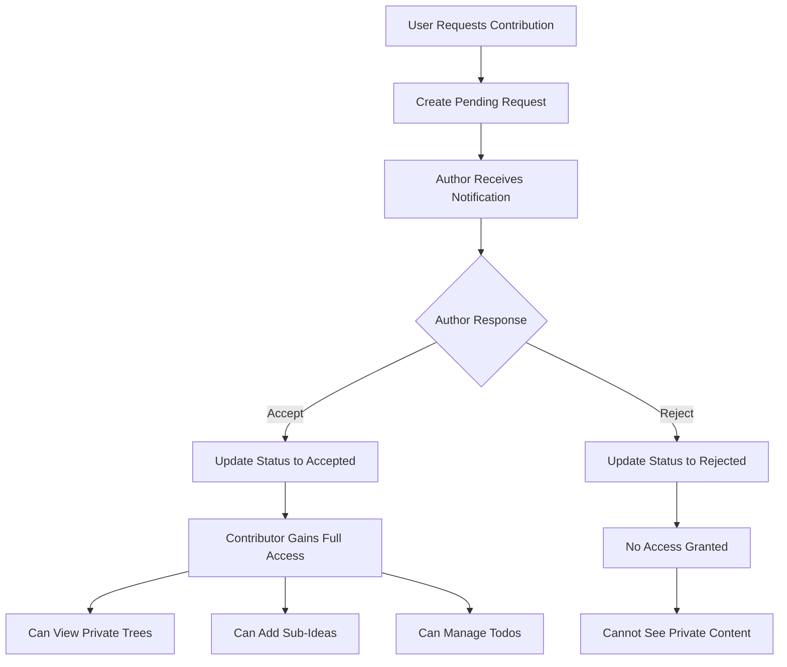

# Idea Visibility System Architecture

## Overview

The idea visibility system implements a hierarchical, role-based access control model that governs how users can view and interact with ideas in the platform. The system supports both public and private visibility levels with inheritance rules for sub-ideas and contributor-based access control.

## Core Concepts

### Visibility Levels
- **Public**: Ideas visible to all users (authenticated and anonymous)
- **Private**: Ideas visible only to authorized users (authors, accepted contributors, sub-idea authors)

### User Roles
- **Anonymous Users**: No authentication, limited to public content
- **General Users**: Authenticated but no special relationship to the idea
- **Authors**: Users who created the root idea
- **Contributors**: Users with accepted contribution requests for the idea
- **Sub-Idea Authors**: Users who created sub-ideas within a tree

## Database Schema

### Ideas Table
```typescript
ideas: defineTable({
  // ... other fields
  visibility: v.string(), // 'public' or 'private'
  authorId: v.id("users"),
  parentId: v.optional(v.id("ideas")), // For hierarchical relationships
  isDeleted: v.optional(v.boolean()), // Soft delete flag
  // ... other fields
})
// Indexes
.index("by_visibility", ["visibility"])
.index("by_author_visibility", ["authorId", "visibility"])
.index("by_parent", ["parentId"])
```

### Contribution Requests Table
```typescript
contributionRequests: defineTable({
  ideaId: v.id("ideas"),
  contributorId: v.id("users"),
  authorId: v.id("users"),
  status: v.union(v.literal("pending"), v.literal("accepted"), v.literal("rejected")),
  // ... other fields
})
.index("by_contributor_status", ["contributorId", "status"])
.index("by_idea_status_created", ["ideaId", "status", "createdAt"])
```

## Visibility Rules

### 1. Root Idea Visibility

#### Public Root Ideas
- **All users** can view the root idea and all its sub-ideas
- Visibility inheritance ignores sub-idea visibility settings
- Public root ideas appear in public feeds and searches

#### Private Root Ideas
- Only **authorized users** can view the entire tree:
  - Root idea author
  - Users with **accepted** contribution requests for the root idea
  - Authors of sub-ideas within the tree
- **Anonymous users** and general users cannot see private root ideas

### 2. Sub-Idea Visibility Inheritance

#### Under Public Root Parent
- **All sub-ideas are visible** to everyone (inheritance overrides sub-idea visibility)
- Sub-idea visibility settings are effectively ignored
- This ensures public root ideas maintain full visibility

#### Under Private Root Parent
- Sub-idea visibility follows the root parent's private rules
- Only authorized users (contributors, sub-authors) can see any sub-ideas
- Individual sub-idea visibility settings don't provide additional access

### 3. Contribution-Based Access

#### Accepted Contributors
- Users with **accepted** contribution requests gain full access to:
  - The entire idea tree (all sub-ideas)
  - Ability to create new sub-ideas
  - Todo management permissions
- Access is granted regardless of individual sub-idea visibility settings

#### Pending/Rejected Contributors
- No special visibility privileges
- Cannot see private content they're not authorized for
- Cannot access private trees

### 4. Author Permissions

#### Root Authors
- Full control over their ideas
- Can change visibility settings
- Can see all sub-ideas regardless of visibility
- Can manage contribution requests

#### Sub-Idea Authors
- Can view their own sub-ideas
- Can see the parent tree if they have access
- Limited management permissions (cannot delete parent ideas)

## API Endpoints and Permissions

### Public Endpoints
- `getPublicIdeas`: Returns only public root ideas (no sub-ideas)
- Accessible by all users including anonymous

### Protected Endpoints
- `getIdeaById`: Checks idea existence and deleted status
- `getIdeaTree`: Implements complex visibility logic
- `getUserIdeas`: Returns user's own ideas (all visibility levels)

### Authorization Checks
- All mutations require authentication
- Idea updates/deletions require author permission
- Sub-idea creation requires author or accepted contributor status
- Contribution request management requires author permission

## Frontend Implementation

### UI Components

#### Visibility Settings
```typescript
// Radio buttons for public/private selection
<label className="flex items-center space-x-3">
  <input type="radio" name="visibility" value="public" />
  <div>
    <div className="font-medium text-sm">Public</div>
    <div className="text-xs text-muted-foreground">Visible to all users</div>
  </div>
</label>
```

#### Permission-Based Rendering
```typescript
const canEdit = idea.isAuthor;
const canAddSubIdea = userId && (idea.isAuthor || hasAcceptedContribution);
const canManageTodos = userId && (idea.isAuthor || hasAcceptedContribution);
```

### Feed Logic
- Public feed shows only public root ideas
- User feed shows all user's own ideas (private included)
- Search respects visibility rules

## Edge Cases and Special Rules

### Deleted Ideas
- Authors can still view their deleted ideas
- Deleted ideas are hidden from public feeds
- Soft deletion sets visibility to private
- Contribution requests for deleted ideas are auto-rejected

### Hierarchical Trees
- Visibility is determined by the **root parent** only
- Sub-ideas cannot be more visible than their root
- Root visibility changes affect entire tree visibility

### Invitations and Requests
- Invitations are sent to specific users (bypassing general visibility)
- Pending requests don't grant visibility
- Only **accepted** requests provide access

### Mixed Visibility Scenarios
- Private sub-ideas under public roots: sub-idea is visible (root overrides)
- Public sub-ideas under private roots: sub-idea follows root's private rules

## System Flow Diagrams

### Idea Creation Flow
```
User → Select Visibility → Create Idea → Notifications Sent
                                      ↓
                         Public: Notify all users
                         Private: No notifications
```

### Idea Access Flow
```
User Request → Check Authentication → Check Idea Visibility
    ↓                    ↓                        ↓
Anonymous     General User       Public: Allow access
                              Private: Check authorization
                                        ↓
                         Author/Contributor: Full access
                         Other: Deny access
```

### Sub-Idea Creation Flow
```
User → Check Parent Access → Has Author/Contributor Permission?
    ↓                        ↓
   No → Deny                Yes → Create Sub-Idea → Set Visibility
                                                  ↓
## System Flow Diagrams

### Idea Access Flow


### Permission Check Flow


### Visibility Inheritance Flow


### Contribution System Integration

                                    Public: Notify all users
                                    Private: No notifications
```

## Testing and Validation

### Test Coverage
- Anonymous user access to public/private content
- Authenticated user access with different roles
- Sub-idea visibility inheritance
- Contribution request state changes
- Hierarchical tree traversal

### Manual Test Commands
```bash
# Test public root idea visibility
npx convex run ideas:getIdeaTree '{"rootIdeaId":"public_idea_id"}'

# Test private root idea visibility (should return null for anonymous)
npx convex run ideas:getIdeaTree '{"rootIdeaId":"private_idea_id"}'
```

## Security Considerations

### Access Control
- All visibility checks happen server-side in Convex queries
- Client-side UI reflects server permissions but doesn't enforce them
- Authentication required for all write operations

### Data Privacy
- Private ideas don't appear in public feeds
- Deleted ideas maintain privacy (only authors can view)
- Contribution requests are private between requestor and author

### Performance
- Visibility filtering happens at query time
- Indexes support efficient permission checks
- Hierarchical queries use recursive tree traversal

## Future Enhancements

### Potential Features
- Granular permission levels (view-only, edit, delete)
- Time-based visibility (scheduled publishing)
- Group-based access control
- Advanced sharing options (specific user lists)

### Scalability Considerations
- Large trees may need pagination for sub-idea queries
- Caching strategies for frequently accessed public content
- Database query optimization for complex permission checks

## Conclusion

The visibility system provides a robust, hierarchical access control model that balances public discoverability with private collaboration. The inheritance-based approach ensures consistent behavior across idea trees while contributor permissions enable flexible team collaboration.

Key strengths:
- Clear separation between public and private content
- Intuitive inheritance rules
- Integration with contribution system
- Comprehensive testing coverage
- Security-focused server-side enforcement